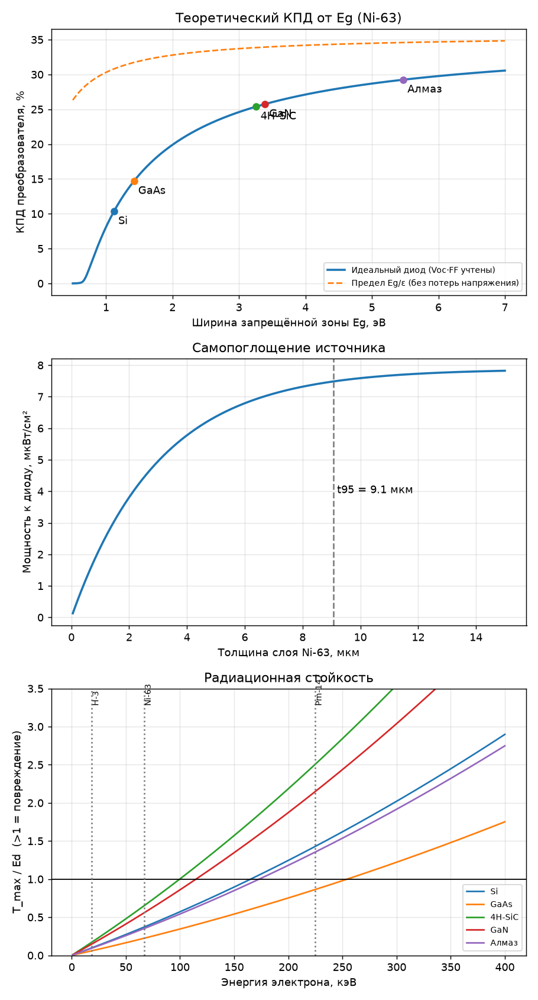
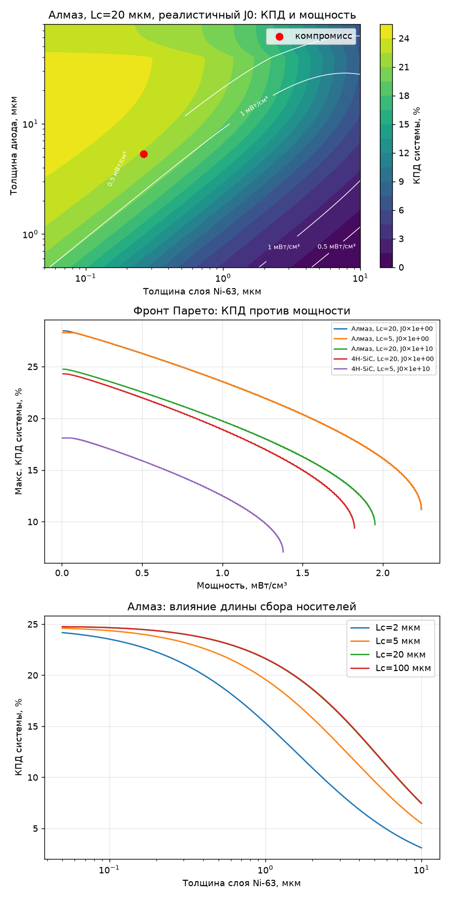
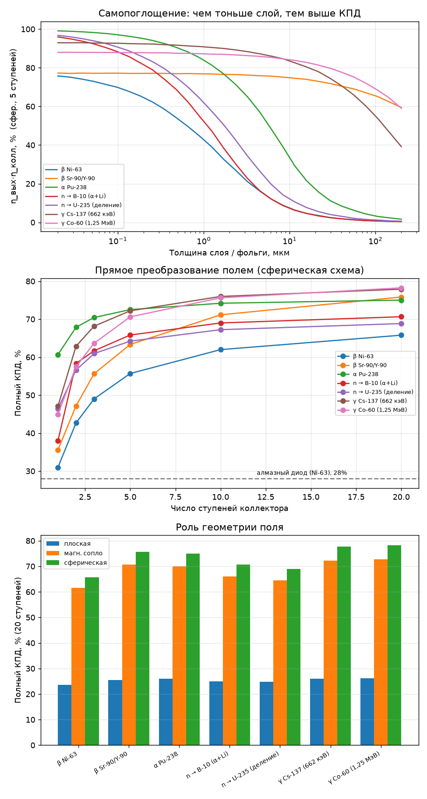
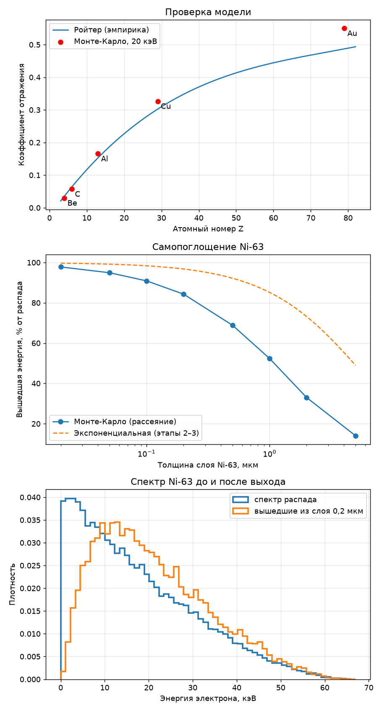
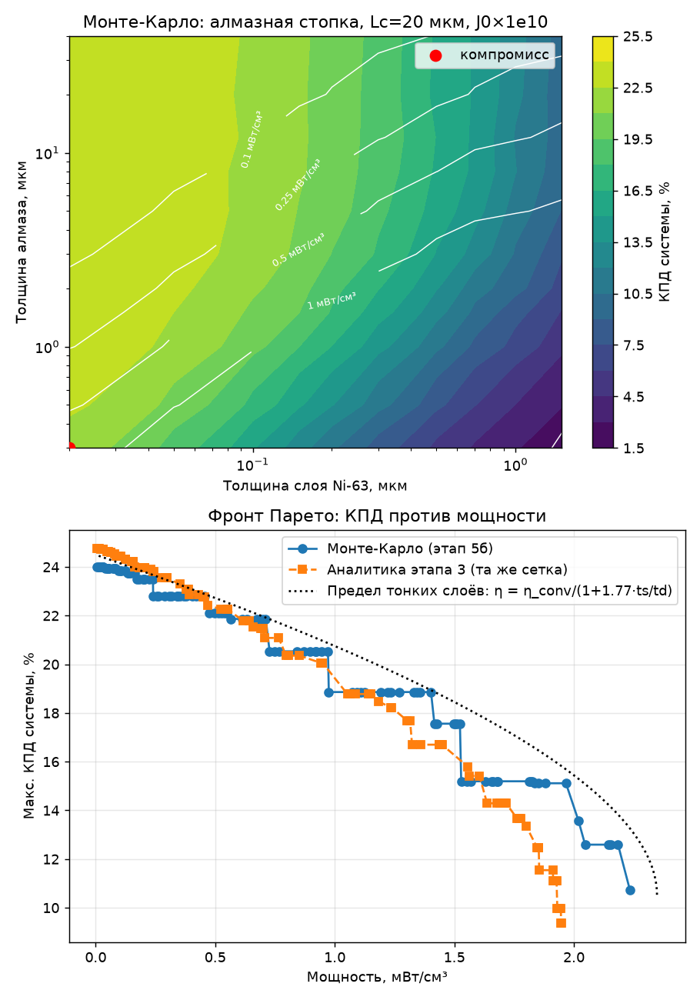
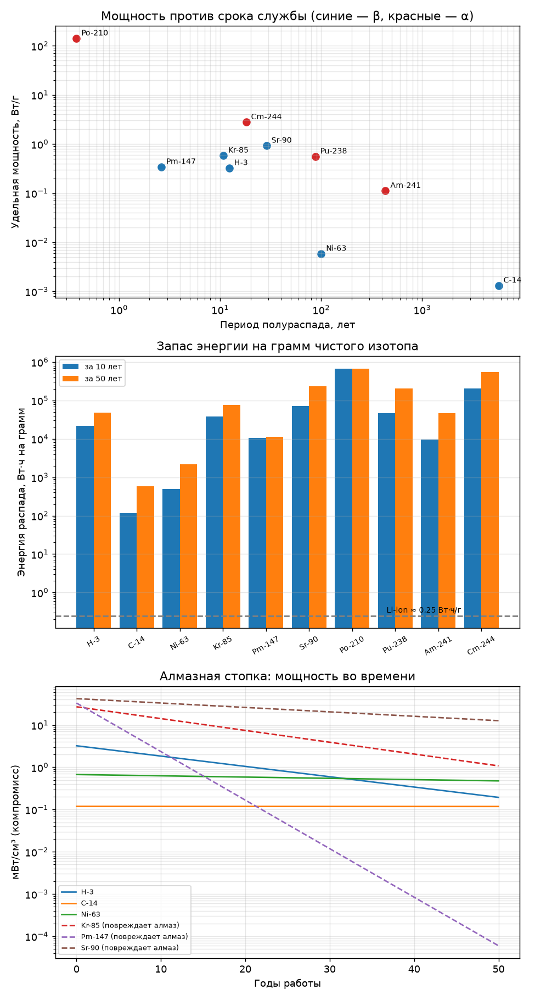

# Исследование: электроэнергия из радиации

Перенесено из чата с Claude. Ниже конспект разговора, модели и результаты.

## Этап 1. Постановка

**Мощность распада:** P = λ·N·Ē, λ = ln2 / T½. Чем короче период полураспада, тем выше мощность и тем быстрее «выдыхается» источник.

| Изотоп | Тип | Ē | T½ | Мощность, чистый изотоп |
|---|---|---|---|---|
| Pu-238 | α | 5,6 МэВ | 88 лет | ≈ 0,57 Вт/г |
| H-3 | β | 5,7 кэВ | 12,3 года | ≈ 0,33 Вт/г |
| Ni-63 | β | 17 кэВ | 100 лет | ≈ 6 мВт/г |

**Пути преобразования:**
1. **Термоэлектрический (РИТЭГ):** η = (ΔT/Tₕ)·(√(1+ZT) − 1)/(√(1+ZT) + T꜀/Tₕ), на практике 5–8%.
2. **Бетавольтаика:** энергия на пару ε ≈ 2,8·E_g + 0,5 эВ (формула Клейна), η = η_источника·η_переноса·η_полупроводника. Теория даёт 20–30%, реальные устройства 1–5%.
3. **Прямой сбор заряда:** напряжение порядка киловольт, ток мизерный.

**Главный тезис (эксергия).** Эквивалентная температура частицы T = E/k: α Pu-238 ≈ 6,5·10¹⁰ K, β Ni-63 ≈ 2·10⁸ K. По Карно предел почти 100%, поэтому низкий КПД вызван несовершенством механизмов, а не фундаментальным запретом. В полупроводнике потолок E_g/ε ≈ 30–35%, остальное уходит в тепло (термализация).
Каскадная схема: η = 1 − Π(1 − ηᵢ), например 30% + 8% ≈ 36%.

**Программа исследования:**
1. Эксергия источников.
2. Карта потерь по механизмам.
3. Обход термализации.
4. Численные модели с оптимизацией.

**Роль теории:** выдать ТЗ на материал и геометрию, затем отобрать кандидатов в базах данных (Materials Project, AFLOW, DFT). Деградацию, границы раздела и технологичность может проверить только эксперимент.

## Этап 2. ТЗ на материал: `betavoltaic_spec.py`

- КПД растёт с E_g и выходит на плато около 30%. Идеальный диод при Ni-63 даёт: Si 9,3%, GaAs 11,7%, GaN 22,4%, 4H-SiC 23,6%, **алмаз 28,1%** (у него же наименьшее обратное рассеяние, 3,8%).
- **Главное узкое место — источник.** Слой Ni-63 толщиной 9 мкм (t95) отдаёт наружу лишь около 16% энергии распада.
- **Радиационная стойкость.** H-3 и Ni-63 безопасны для всех материалов. Pm-147 повреждает Si, SiC, GaN и алмаз. Пороги повреждения: SiC ≈ 100 кэВ, GaN ≈ 115 кэВ, Si ≈ 165 кэВ, алмаз ≈ 173 кэВ.
- **Дефекты (J0 × 10²⁰).** 4H-SiC падает до 12,3%, алмаз держит 20,9%.
- Требуемая длина сбора W+L составляет порядка 20–30 мкм.

**ТЗ:** алмаз (запасной вариант 4H-SiC) + Ni-63 или H-3 + двусторонняя многослойная структура с тонкими слоями источника.

## Этап 3. Многослойная стопка: `betavoltaic_stack.py`

1D-модель: экспоненциальное ослабление потока, многократный проход по стопке суммируется геометрическим рядом.

- КПД системы вырастает с ~4,5% до ~22%.
- **Компромисс КПД ↔ мощность** (реалистичный алмаз, Lc = 20 мкм, J0×10¹⁰):
  - максимальный КПД 24,7% при мощности 0,02 мВт/см³;
  - максимальная мощность 1,95 мВт/см³ при КПД 9,7% (~520 слоёв на мм);
  - **компромисс:** Ni-63 0,26 мкм + алмаз 5,3 мкм, η = 22,3%, P = 0,55 мВт/см³.
- При тонких слоях длина сбора почти не важна, поэтому требования к качеству алмаза снижаются.
- Энергия за 100 лет ≈ 350 Вт·ч/л (у Li-ion ≈ 700 Вт·ч/л за один цикл). Для 1 мВт нужно ~1,8 см³ стопки и ~0,8 г чистого Ni-63. Обогащение 15% даёт мощность в ~7 раз меньше.
- **Ниша:** микро- и милливатты на десятилетия без обслуживания (кардиостимуляторы, датчики, космос).

> ℹ️ **Проверка Монте-Карло (этап 5б):** итог этапа 3 подтверждён — компромисс ≈ 22% при 0,55 мВт/см³. Оптимальная геометрия другая: слои тоньше (Ni-63 0,05 мкм + алмаз 1 мкм).

**Ограничения модели:** эмпирические формулы пробега и рассеяния, идеальный диод, 1D. Не учтены контакты и подложки, а также возврат обратно рассеянных электронов.

## Этап 4. Прямое преобразование полем для всех видов радиации: `direct_conversion.py`

**Идея.** Заряженная частица, которая летит против электрического поля, тормозится и отдаёт кинетическую энергию целиком, без дробления на электрон-дырочные пары. Поэтому здесь не действует потолок E_g/ε ≈ 30%. Напряжение создают сами частицы: коллектор заряжается, как конденсатор, а рабочую точку задаёт нагрузка. Статическое поле энергию не тратит, потери идут только через утечку.

**Общая цепочка** для любого излучения:
η = η_захв · η_вых · η_геом · η_колл(N) · η_доп

| Звено | Смысл |
|---|---|
| η_захв | Излучение → заряженные частицы в веществе. Для α и β равно 1; для γ — поглощение в фольгах; для нейтронов — конвертер (B-10, U-235) |
| η_вых | Выход частиц из слоя (самопоглощение) |
| η_геом | Доля энергии вдоль поля: в плоской схеме E·cos²θ; магнитное «сопло» (B не совершает работы, но переводит E⊥ в E∥ при расширении поля); в сферической схеме ≈ 1 |
| η_колл | Многоступенчатый коллектор: оптимальные напряжения N электродов (динамическое программирование по спектру) |
| η_доп | 0,86 = отражённые и вторичные частицы (0,97) · утечки (0,99) · преобразователь кВ → В (0,90) |

**Результаты** (Монте-Карло, 60 тыс. частиц; полный КПД с η_доп, 20 ступеней):

| Излучение | Слой, мкм | Плоская | Магн. сопло (×10) | Сферическая | U верхней ступени |
|---|---|---|---|---|---|
| β Ni-63 | 0,2 | 23% | 61% | **66%** | 51 кВ |
| β Sr-90/Y-90 | 20 | 25% | 71% | **76%** | 1,9 МВ |
| α Pu-238 | 1 | 26% | 70% | **75%** | 2,7 МВ |
| n → B-10 (α+Li) | 0,3 | 25% | 66% | **71%** | 0,7 МВ |
| n → U-235 (осколки деления) | 0,5 | 25% | 65% | **69%** | 4,6 МВ |
| γ Cs-137 (Pb-фольга) | 10 | 26% | 72% | **78%** × η_захв | 0,6 МВ |
| γ Co-60 (Pb-фольга) | 20 | 26% | 73% | **78%** × η_захв | 1,2 МВ |

**Выводы:**
1. **Поле универсально.** Все виды радиации сходятся к 65–80%, это в 2–3 раза выше лучшего полупроводника (28%). Полю нечему разрушаться, поэтому альфа-частицы и осколки деления, которые губят полупроводники, здесь — лучшее «топливо».
2. **Геометрия важнее всего.** Плоская схема теряет в 3 раза. Нужен радиальный поток (сфера или цилиндр) или магнитное сопло.
3. **Ступени.** Одна ступень даёт 30–60%, пять — 55–73%, двадцать — 66–78%. Выше 90% в сумме закрыто связкой «ступени × преобразователь × отражение», теоретическая цель — 75–85%.
4. **Гамма — самое трудное.** Чтобы поглотить 90% энергии, нужно ~3 см свинца (Cs-137) или ~6 см (Co-60). Это около 2900 фольг с вакуумными зазорами по 4–7 см под сотни киловольт, стопка в сотни метров, а плоская геометрия даёт КПД ≈ 10%. Идея «собирать гамма-фон полем» физически разрешена, но неприменима без принципиально нового конвертера.
5. **Инженерные вызовы:** напряжения от десятков киловольт до мегавольт при наноамперах, изоляция больше 10¹⁴ Ом, защита изоляторов от облучения, подавление вторичных электронов (особенно для α), преобразование МВ → В.

**Ограничения:** прямолинейные траектории (для электронов в свинце это грубо, они сильно рассеиваются), степенной закон пробега, изотропный вылет (комптоновские электроны на самом деле летят преимущественно вперёд, что помогает). Коэффициенты μ_en свинца приближённые, их нужно сверить с NIST XCOM. Заряд осколков деления принят ≈ 20e (на деле он меняется при торможении).

## Этап 5. Монте-Карло переноса электронов: `mc_electrons.py`

Прямолинейную модель заменяет модель одиночного рассеяния Джоя: каждое упругое столкновение с атомом (экранированный Резерфорд) разыгрывается отдельно, потери энергии считаются по Бете с поправкой Джоя–Луо, траектории трёхмерные. Применимость 0,5–100 кэВ — весь спектр Ni-63.

**1. Проверка модели** — коэффициент отражения при 20 кэВ:

| | Be | C | Al | Cu | Au |
|---|---|---|---|---|---|
| Монте-Карло | 0,030 | 0,057 | 0,166 | 0,327 | 0,550 |
| Ройтер (эксперимент) | 0,036 | 0,064 | 0,153 | 0,302 | 0,487 |

Совпадение в пределах ~10%. Для тяжёлых элементов модель немного завышает отражение, это известная особенность модели Джоя.

**2. Выход энергии из слоя Ni-63** (обе грани):

| Слой, мкм | 0,02 | 0,05 | 0,1 | 0,2 | 0,5 | 1 | 2 | 5 |
|---|---|---|---|---|---|---|---|---|
| Монте-Карло | 98% | 95% | 91% | 84% | 69% | 52% | 33% | 14% |
| Экспоненциальная (этапы 2–3) | 100% | 99% | 98% | 97% | 92% | 85% | 73% | 49% |

- **Этапы 2–3 были оптимистичны:** электроны блуждают, их путь в никеле длиннее, чем по прямой. Слои источника нужно делать ещё тоньше: около 0,1–0,2 мкм.
- **Этап 4 подтверждён:** для слоя 0,2 мкм прямолинейная модель дала 81%, Монте-Карло — 84%.
- **Подложка:** на углероде 0,1 мкм выход 83%, на углероде 1 мкм — 71%, на никеле или золоте 1 мкм — около 58%. Нужна сверхтонкая подложка из лёгкого элемента (углеродная или алмазная мембрана).

**3. Отражение от коллектора** при энергии посадки 1–40 кэВ: бериллий 2–5%, углерод 5–7%, медь 33–38%. Коллектор должен быть из лёгкого элемента. Медь теряет треть энергии.

**4. Пересчёт полного КПД** для Ni-63 (слой 0,2 мкм, сферическая схема, углеродный коллектор, утечки 0,99, преобразователь кВ → В 0,90):

| Ступеней | Выход × коллектор | Потери на отражение (C) | **Полный КПД** |
|---|---|---|---|
| 1 | 37,8% | 6,5% | **31,5%** |
| 5 | 67,7% | 6,7% | **56,3%** |
| 20 | 79,4% | 5,9% | **66,6%** |

Итог этапа 4 (66%) подтверждён. Бериллиевый коллектор даёт ~68%. Отражённый электрон считается полностью потерянным, то есть оценка консервативная.

**Ограничения:** нет разброса потерь энергии (страгглинга), нет вторичных электронов с энергией меньше 50 эВ (их гасит сетка с небольшим смещением), потери энергии нерелятивистские (ошибка несколько процентов около 60 кэВ). Для γ-фольг из свинца (МэВ-электроны) эта модель не годится, там нужен Geant4.

## Этап 5б. Алмазная стопка методом Монте-Карло: `mc_stack.py`

Бесконечная периодическая стопка «Ni-63 | алмаз | …». Электроны прослеживаются до полной остановки, энергия распределяется по никелю, зоне сбора диода и «мёртвой» зоне. Отражение, блуждание и многократные проходы через слои учтены. Сетка — 110 конфигураций по 3000 электронов.

**Главный результат: итог этапа 3 устоял, изменилась геометрия.**

| Реалистичный алмаз (Lc = 20, J0×10¹⁰) | Этап 3 (аналитика) | Монте-Карло, слои ≥ 0,05/1 мкм | Монте-Карло, слои до 0,02/0,3 мкм |
|---|---|---|---|
| Макс. КПД | 24,7% | 23,3% | 24,0% |
| Макс. мощность | 1,95 мВт/см³ при 9,7% | 1,88 мВт/см³ при 10,8% | 2,23 мВт/см³ при 10,7% |
| **Компромисс** | 22,3%, 0,55 мВт/см³ (0,26 + 5,3 мкм) | **22,1%, 0,55 мВт/см³ (0,05 + 1 мкм)** | 21,9%, 0,71 мВт/см³ (0,02 + 0,3 мкм) |

Прямое умножение на коэффициент выхода (поправка «19%» из этапа 5) было неверным упрощением. В стопке электрон, покинувший никель «назад», попадает в соседний диод, и потери частично возвращаются.

**Новый закон: предел тонких слоёв.** Когда слои много тоньше пробега электронов (≈ 2 мкм), стопка ведёт себя как однородная смесь. Энергия делится пропорционально тормозной способности, и всё определяет одно число — отношение толщин x = ts/td:

- η(x) = η_conv / (1 + k·x), где k = S_Ni/S_алмаз ≈ **1,77**;
- P(x) = P_распада · η_conv · x / ((1 + x)(1 + k·x));
- максимальная мощность при x = 1/√k ≈ 0,75 даёт P ≈ 2,35 мВт/см³, в алмаз попадает 43% энергии;
- компромисс (90% от η_conv) при x ≈ 0,063 даёт P ≈ 0,68 мВт/см³.

Формула совпадает с Монте-Карло в пределах 5–10%. Практический вывод: **абсолютная толщина слоёв почти не важна, важно их отношение**. Толщину выбирает технология (минимальный рабочий алмазный диод, контакты), а физика задаёт только ts/td. При тонких слоях длина сбора Lc перестаёт влиять, так что качество алмаза ещё менее критично.

## Этап 6. Сравнение изотопов: `isotopes.py`

Все величины считаются из первых принципов: удельная активность A = ln2·N_A/(T½·M), мощность, энергия за 10 и 50 лет. Мощность алмазной стопки берётся по закону тонких слоёв (этап 5б), напряжение сбора полем — по этапу 4.

| Изотоп | T½, лет | Вт/г | Мощность через 20 лет | Алмазный диод | Стопка, мВт/см³ (компромисс) | U поля | Грамм на 1 мВт через 20 лет |
|---|---|---|---|---|---|---|---|
| H-3 | 12,3 | 0,32 | 32% | ✓ | **3,2** (TiT₂) | 19 кВ | **0,04** (стопка) |
| C-14 | 5700 | 0,0013 | 100% | ✓ (не SiC) | 0,12 | 156 кВ | 3,5 (стопка) |
| Ni-63 | 100 | 0,0059 | 87% | ✓ | 0,67 | 67 кВ | 0,9 (стопка) |
| Kr-85 | 10,8 | 0,58 | 28% | ✗ | — | 0,7 МВ | 0,009 (поле) |
| Pm-147 | 2,6 | 0,34 | 1% | ✗ | — | 225 кВ | 0,9 (поле) |
| Sr-90/Y-90 | 28,8 | 0,93 | 62% | ✗ | — | 2,3 МВ | 0,003 (поле) |
| Po-210 | 0,38 | 141 | 0% | ✗ α | — | 2,7 МВ | не доживает |
| Pu-238 | 87,7 | 0,56 | 85% | ✗ α | — | 2,8 МВ | 0,003 (поле) |
| Am-241 | 433 | 0,11 | 97% | ✗ α | — | 2,7 МВ | 0,014 (поле) |
| Cm-244 | 18,1 | 2,8 | 47% | ✗ α | — | 2,9 МВ | 0,001 (поле) |

(«Алмазный диод ✓» — частицы не выбивают атомы решётки, то есть T_max < Ed. Для поля принят КПД 67% (этап 5), для стопки — 22%.)

**Выводы:**
1. **Фундаментальный компромисс:** удельная мощность ∝ Ē/(M·T½). Долгоживущий изотоп даёт мало мощности, а мощный быстро «выдыхается».
2. **Для полупроводника есть только три изотопа: H-3, Ni-63 и C-14.** Все более энергичные β-излучатели (Pm-147, Kr-85, Sr-90) и все α-излучатели разрушают даже алмаз. Для них остаётся только поле, и это сильный довод за этапы 4–5.
3. **Тритий — лидер по мощности стопки** (3,2 мВт/см³, в 5 раз больше Ni-63), но за 20 лет он теряет 68% мощности. **Ni-63 — лидер по стабильности** (87% через 20 лет). **C-14** — «вечный» (5700 лет), но мощность в 5 раз ниже Ni-63.
4. **C-14 и трансмутация.** Идея «алмаз из самого источника» (весь диод из ¹⁴C) даёт P ≈ 1,3 мВт/см³, но за год распадается 1,2·10⁻⁴ атомов, то есть в решётке появляется ~2·10¹⁹ атомов азота на см³. Это сильная примесь, которая портит диод. Реалистично делать тонкий слой ¹⁴C-алмаза внутри обычного алмаза.
5. **Поле открывает мощные изотопы.** Pu-238, Cm-244 и Sr-90 дают 1 мВт на миллиграммы вещества против сотен миллиграммов Ni-63, но требуют мегавольтной изоляции. Sr-90 даёт сильное тормозное излучение, Cm-244 — нейтроны, им нужна защита.
6. **Доступность** — главное практическое ограничение: Pu-238 очень дефицитен, Ni-63 обычно обогащён всего на 15–20% (мощность ниже в 5–7 раз), тритий побочно производят тяжеловодные реакторы, Sr-90, Kr-85 и Cm-244 есть в отработанном ядерном топливе, C-14 — в облучённом реакторном графите.

**Рекомендации по нишам:**
- кардиостимуляторы и имплантаты (десятилетия, микроватты, безопасность) — **Ni-63 + алмазная стопка**;
- датчики на 10–15 лет с максимальной мощностью на объём — **H-3 + алмаз**;
- «вечные» метки и маячки на сотни лет — **C-14 в алмазе**;
- космос и мощные автономные источники — **Pu-238, Am-241 или Sr-90 + сбор полем** (или РИТЭГ).

**Ограничения:** закон тонких слоёв для трития, Kr-85 и Sr-90 не проверен Монте-Карло (модель Джоя до ~100 кэВ). Плотности химических форм и газа Kr-85 приближённые. Kr-85 в реальном криптоне — лишь около 6%. Стоимость не оценивалась.

## Следующие шаги (на выбор)

- **В.** Гибрид «поле + полупроводник» и расчёт мощности на объём для сферической и цилиндрической схем.
- **Г.** Тритиевая стопка методом Монте-Карло (H-3 в TiT₂ + алмаз) — проверить лидера по мощности.
- **Д.** Сводный отчёт по этапам 1–6 (для гранта или партнёрства с университетом).
